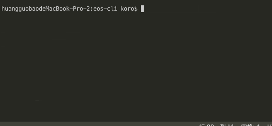

# 一个类似vue-cli的脚手架
> 一个类似vue-cli的脚手架,用于学习脚手架开发理念：下载模板,通过命令行交互, 处理下载的模板

本项目基于：[eos-cli](https://github.com/YvetteLau/Blog/tree/master/eos-cli)

### example:



## 全局安装：

```js
npm install koro-cli -g
```

mac环境下要加`sudo`。

### 演示


## 本地调试

### 下载项目。

### 安装依赖

`npm install`

### 监听变动,方便本地调试

`npm run watch`

### 修改配置文件位置：

本地调试将配置文件放在项目中，方便调试：

```js
// constants.js
// 配置文件目录
// export const RC = `${HOME}/.kororc`;
export const RC = `./.kororc`; //本地调试将配置文件放在项目中，方便调试
```

### 创建配置文件：

```js
npm run postinstall
```

本地开发的时候需要创建该文件，发布到`npm`上就不用了。

因为用户`install`之后，会自动执行`npm run postinstall`

### 执行 `npm link`

将`package.json`上的配置，链接到全局, 此时就可以使用 `koro` 命令了。

mac 环境下要使用`sudo npm link`才能链接全局环境。

### 下载模板：

本项目是一个学习项目, 项目内置模板为一个只有`readme`的[仓库](https://github.com/OBKoro1/Brush_algorithm),并且不会有任何操作。

```js
koro init testName // 下载模板到testName文件夹
```

#### 修改下载仓库：

```js
eos config set registry OBKoro1 // 修改用户
eos config set templateName codeBlack // 修改仓库名
```

#### 自定义模板

正常情况下：应该根据用户命令行交互的命令,通过`node.js`来自定义项目模板，这一步需要大家自己做了。

### 发布

开发完成后，即可发布至 npm, 用户通过 `npm install koro-cli -g` 全局安装。 即可使用 `koro` 命令

### 注意事项： 

1. 更改package的bin属性即可更改命令名称

```js
"bin": {
    "else": "./bin/www"
}
```

注意`postinstall`也要修改。

2. 发布之前要将`.kororc`文件改回去：

```js
// 配置文件目录
export const RC = `${HOME}/.kororc`; // 全局读取
// export const RC = `./.kororc`; // 本地调试将配置文件放在项目中，方便调试
```


